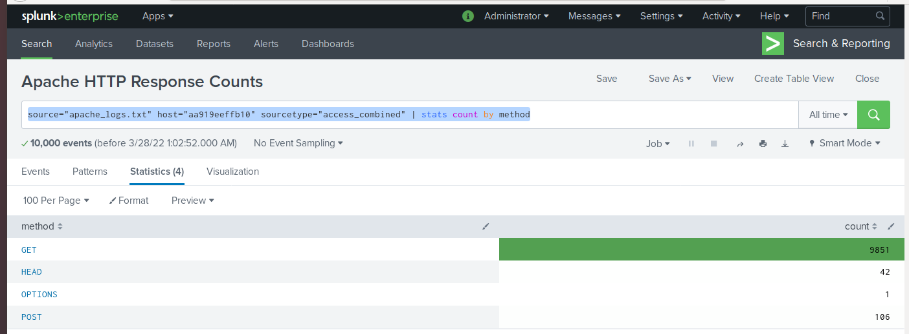

# Splunk Queries and Reporting 
- These are example so of queries I've run on Apache and Window Servers Logs as part of a 2022 course on cybersecurity where I was using Splunk for SOC monitoring

## Apache HTTP Response Values Observed 
- This query will report the distinct HTTP responses observed in a data set. This was the basis for a table of the different HTTP methods (GET, POST, HEAD, etc). This provided insight into the type of HTTP activity being requested against a web server.
`source="apache_logs.txt" host="aa919eeffb10" sourcetype="access_combined" | stats values(method)`

## Apache HTTP Response Counts
- This query provide insight into any suspicious levels of HTTP responses.
`source="apache_logs.txt" host="aa919eeffb10" sourcetype="access_combined" | stats count by method`

## Apache Server IP Locations Outside of the United States
- This report establishes the baseline to inform an alert
`source="apache_logs.txt" | iplocation clientip | where Country!="United States" |stats count by _time | stats avg(count) median(count) min(count) max(count)`

### Apache Server Alert for IP Locations Outside of the USA observed 
- This is the hourly alert monitor in Splunk to report when non-US hits to the Apache server is above baseline 

`source="apache_logs.txt" | iplocation clientip | where Country!="United States" |  bucket_time span=1h | stats count by _time | stats avg(count) median(count) min(count) max(count)` 